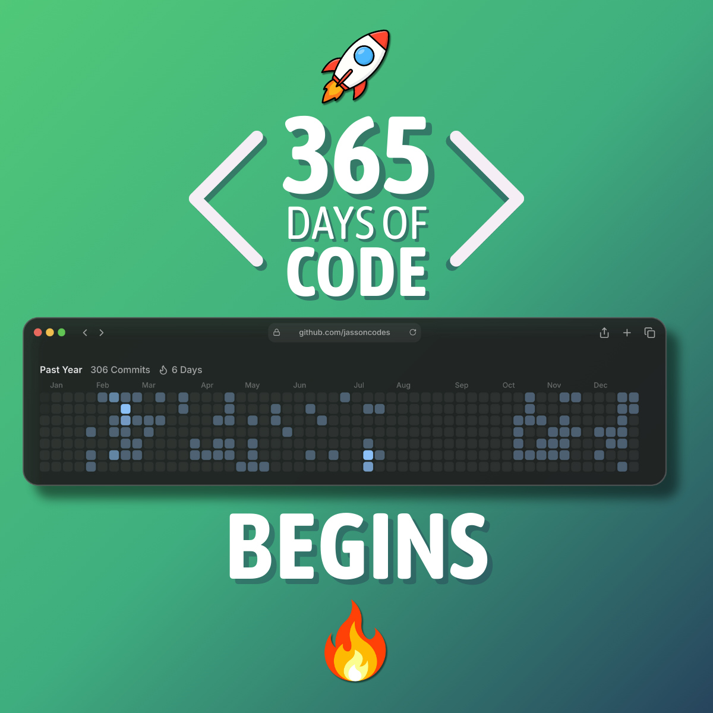

# 365 Days of Code 🚀

Welcome to my **365 Days of Code Challenge**.

This is a personal initiative focused on **consistent practice, real problem-solving, and learning in public** to grow as a **Full Stack Developer**.

---

## 📌 Project Overview

The goal of this challenge is simple:  
**code every day for 365 days**.

Each day, I’ll work on coding exercises, technical challenges, or small implementations focused on both **frontend and backend development**.  
Challenges may come from online platforms or be generated by AI when I want to explore specific concepts.

This approach helps me:

- Strengthen problem-solving skills
- Improve consistency and discipline
- Build practical experience with real-world patterns
- Document my learning journey publicly

---

## 🎯 Key Objectives

1. **Daily Coding Practice**  
   Commit to coding every day, even if it’s a small task.

2. **Tech Interview–Style Challenges**  
   Focus on problems commonly found in technical interviews, system design basics, and practical coding scenarios.

3. **Progress Tracking**  
   Document solutions, challenges faced, and lessons learned through commits and notes.

4. **Build in Public**  
   Share progress, insights, and learnings with the developer community through social media.

---

## 🛠 Tech Stack

While this challenge is stack-agnostic by nature, I’ve chosen to focus on a **specific Full Stack setup** to deepen my expertise:

### 🎨 Frontend

- JavaScript
- TypeScript
- React
- Tailwind CSS

### ⚙️ Backend

- C#
- .NET Core

The stack used may vary depending on the challenge or learning goal of the day.

---

## 🚀 Getting Started

My personal rules for this challenge:

1. **Consistency over perfection**  
   Small progress every day beats big gaps.

2. **Learn by doing**  
   Focus on hands-on coding rather than passive learning.

3. **Reflect regularly**  
   Review what worked, what didn’t, and what can improve.

4. **Keep it public**  
   Share progress to stay accountable and connect with others.

---

## 📈 Progress Tracking

All progress is documented in this repository through:

- Daily or grouped commits
- Code solutions
- Notes and improvements over time

Follow the journey here:  
👉 **https://github.com/jassoncodes/365-days-of-code**

---

## 🌍 Connect with Me

I’ll be sharing updates, learnings, and reflections throughout the challenge:

- **LinkedIn:** https://www.linkedin.com/in/jassoncodes
- **X (Twitter):** https://x.com/jassoncodes
- **Instagram:** https://www.instagram.com/jassoncodes

---

## 🤝 Support & Feedback

Feedback, suggestions, and discussions are always welcome.  
If you’re also building, learning, or just curious — feel free to reach out.

Let’s grow by building, one day at a time 💪

**Happy coding!**
